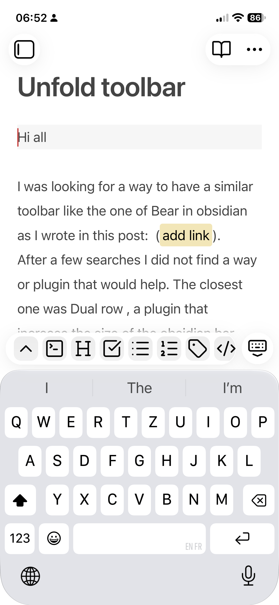
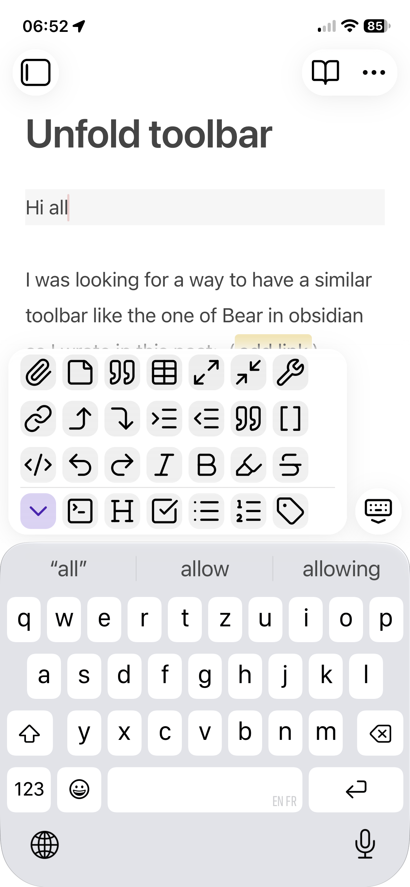
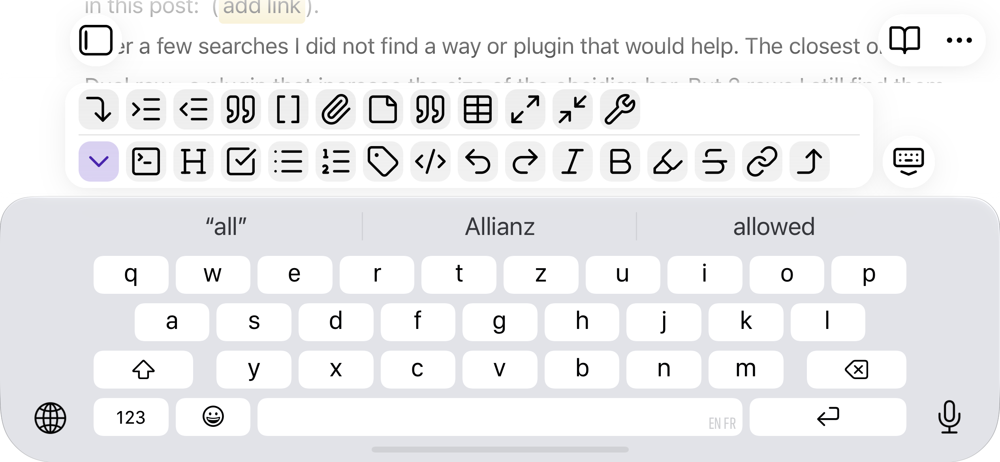

# Unfold Toolbar

A mobile plugin for Obsidian that lets the editing toolbar unfold into several rows, so every shortcut is visible at once, and fold back to a single row with the same button.

Obsidian's mobile toolbar is a single row that scrolls sideways. With many shortcuts, most of them are out of sight. Unfold Toolbar keeps that row exactly as it is and adds a button that grows the toolbar upward, a little like a formatting keyboard.

Attention: the plugin is only available through BRAT.

## Screenshots

| Folded                                                                                                            | Unfolded (portrait)                                                                                                                     |
| ----------------------------------------------------------------------------------------------------------------- | --------------------------------------------------------------------------------------------------------------------------------------- |
|  |  |

**Unfolded (landscape)**

## How to use it

1. Open a note and tap into it so the keyboard and toolbar appear.
2. Tap the chevron button (⌃). The toolbar unfolds into several rows.
3. Tap the button again (now ⌄, on an accent-coloured tile) to fold it back.

You can also swipe up on the toolbar to unfold it, and swipe down to fold it. If some rows are scrolled out of sight above, the first swipe down shows them and the next one folds.

When you start typing in the note again, the unfolded toolbar folds back by itself. Tapping its buttons keeps it open, so you can tap undo or indent several times in a row.

Your usual row never moves. Rows fill from the bottom up, so the folded row becomes the bottom row of the unfolded toolbar, and the extra shortcuts appear above it. A thin line separates the folded row from the extra rows.

## Setup

1. Install the plugin and enable **Unfold Toolbar** under *Settings → Community plugins*.
2. Go to *Settings → Mobile → Toolbar*. In the section for adding commands, search for **Unfold Toolbar: Fold or unfold**.
3. Drag it to the **top** of the toolbar list. It works in any position, but it only stays exactly in place when unfolding if it sits in your usual row.
4. Add the rest of your shortcuts in the order you like. The first ones fill the bottom row; later ones fill the rows above.

Do not run the plugin together with another plugin that restyles the mobile toolbar (for example *Double row toolbar*). Disable the other one first.

### Installing with BRAT

Install it with [BRAT](https://github.com/TfTHacker/obsidian42-brat):

1. Install and enable BRAT.
2. Run **BRAT: Add a beta plugin for testing** and paste this repository's URL: `https://github.com/SpinEchoArcanist/obsidian-unfold-toolbar`.
3. Enable Unfold Toolbar under *Community plugins*.

## Settings

| Setting          | Default | Choices  | Notes                                                                                                                                       |
| ---------------- | ------- | -------- | ------------------------------------------------------------------------------------------------------------------------------------------- |
| Start folded     | On      | On / Off | On: the toolbar opens as a single row each time you start editing. Off: it stays as you left it, remembered separately on each device.      |
| Animate          | Off     | On / Off | The toolbar unfolds and folds with a short motion (150 ms to unfold, 110 ms to fold). Skipped when your device is set to reduce motion.     |
| Phone, portrait  | 4 rows  | 2–6      | Select how many rows are applied when the toolbar is unfolded. More rows let you see more commands, but take up more screen space. |
| Phone, landscape | 2 rows  | 1–3      | The keyboard takes most of the screen in landscape. 1 row keeps the toolbar folded.                                                         |
| Tablet           | 4 rows  | 2–8      | Used in both orientations.                                                                                                                  |

If you have more shortcuts than fit in the chosen rows, the unfolded toolbar scrolls up to show them. It always starts at the bottom row. A soft fade on the edge of the rows shows when more are out of sight, and follows the rows while you scroll.

### Experimental features

The settings end with an *Experimental* section. New features are released there first, **switched off**, so an update never changes how the toolbar behaves for you until you choose to try something. Once a feature has been tested, it either becomes standard behaviour or is removed, and leaves this section.

Nothing is being tested at the moment, so the section only shows a short note.

## Appearance

The plugin also gives every toolbar button a soft rounded tile, adds a little space at the ends of each row, and uses a gentler corner radius when unfolded. These styles apply to the folded toolbar too: if they changed only when unfolding, your usual row would shift each time. Colours follow your theme in light and dark mode.

On narrow phones, the extra space at the row ends can fit one button fewer per row.

When unfolded, the toolbar ends right after its last whole column, so there is no empty strip at its right end. Its left edge stays where it is when folded, so no button moves.

## How it works

Obsidian draws its mobile toolbar just above the keyboard and reserves room for it using one value, `--mobile-toolbar-height`. When you unfold:

- The plugin adds a class to the page that raises that value by the extra rows. The toolbar grows upward and the note area shrinks by the same amount, so nothing is covered.
- The buttons wrap into rows from the bottom up, each with the same width as in the folded row, so every button keeps its column.
- Obsidian marks the page as *phone* or *tablet* and the screen as portrait or landscape. The stylesheet picks the matching row count from that, so rotating the device or using iPad Split View needs no extra code.
- The fold button is a normal Obsidian command, so it lives in Obsidian's own toolbar settings. The plugin never adds or removes buttons.

## Limitations

- The plugin relies on parts of Obsidian's mobile toolbar that are not an official API (its class names and the `--mobile-toolbar-height` value). An Obsidian update could change them. If that happens, the toolbar falls back to Obsidian's normal single row; nothing else is affected.
- The plugin does nothing on desktop. Its settings are available there, so they can be prepared and synced to mobile.

## Acknowledgments

This plugin is inspired by the Double Row Toolbar plugin: [Double row toolbar - Obsidian Plugin](https://community.obsidian.md/plugins/double-row-toolbar).
After some research I was looking for a plugin that would make the toolbar more user friendly on mobile, and closer to the user experience of Bear toolbar.
Double Row Toolbar was the closest thing I could find, and I sincerely thank the developer for his work. The plugin increases the toolbar size to a constant two rows height. While this functionality allows the user to see more commands at once, because the height is fixed it always takes up quite some vertical space on an already small mobile phone even when the user does not need it. At the same time for me 2 rows were not enough to visualise all the commands I wanted, so the size was not optimal.

I thus created this plugin to have a better toolbar user experience: When the toolbar is not needed it takes up a single row, so the most useful commands are always available, but the least vertical space is taken up. Then with a button within the toolbar itself, the toolbar unfolds to 4 rows to show all the commands in one go, and make the command search easier. This unfolded vertical height can also be adapted in the settings (from 2 to 6 rows on a phone in portrait, 1 to 3 in landscape, and 2 to 8 on a tablet) to adapt it to your own number of commands.

## Changelog

**0.3.2**
- Swipe up on the toolbar to unfold it, and down to fold it.
- The unfolded toolbar folds back by itself when you resume typing; tapping its buttons keeps it open.
- A fade on the edge of the rows shows when more buttons are out of sight, and follows the rows while you scroll.
- The unfolded toolbar fits whole columns, with no empty strip, and keeps its left edge so no button moves.
- New *Animate* setting (off by default): a short motion when unfolding and folding.
- New *Experimental* section in the settings, where future features are tested before they become standard.
- Settings changed on another device now apply without restarting Obsidian.

**0.2.1**
- Settings now appear in Obsidian's settings search (Obsidian 1.13 and later).
- "Start folded" moved to the top of the settings tab.

**0.2.0**
- Buttons drawn as soft tiles, more space at the row ends, gentler corners when unfolded.
- A line separates the folded row from the extra rows; the fold button shows an accent tile when unfolded.
- The toolbar is laid out again after the screen rotates, to avoid a narrower toolbar bug.

**0.1.1**
- The unfolded toolbar gets an explicit width matching the folded row.

**0.1.0**
- First version: fold and unfold, rows per device and orientation, "Start folded" setting.
